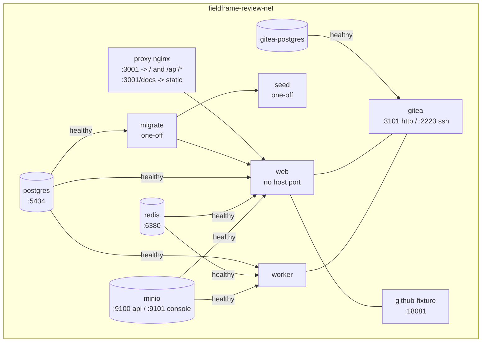

# Annotation Platform — Review / Demo Environment

An isolated Docker Compose stack for colleagues to review the annotation
platform, without touching anyone's local dev stack. It runs on its own
network, volumes, and host ports, so it can start alongside
`docker-compose.yaml` with no conflicts.

## Architecture



- **proxy** — nginx, Review-only. The single published host port (`3001`): reverse-proxies `/` and `/api/*` to `web` unchanged, and separately serves the standalone Swagger UI docs (`specs/api/dist/`, built by `pnpm docs:build`) at `/docs`, same-origin with the app and API so "Try it out" needs no CORS support. See `docker/review-proxy.conf` and `specs/api/README.md`.
- **postgres / redis / minio** — same roles as the main dev stack, scoped to this review environment.
- **migrate** — one-off container that runs `prisma migrate deploy` against a fresh database, then exits.
- **seed** — one-off container that runs `prisma/review.seed.ts` right after `migrate` exits successfully: creates a demo admin user, demo Dataset, and 4 demo Labels, purely as a convenience.
- **web / worker** — start as soon as `migrate` completes; they do **not** wait on `seed`, so real self-registration works immediately with no dependency on the seeded account.
- **gitea + gitea-postgres + github-fixture** — included so colleagues can also review the repository-import feature.

## Running it

First time only — create your local env file from the template:

```bash
cp .env.review.example .env.review
```

`.env.review` is gitignored; edit it (not the `.example`) if you need to change
anything for your machine, e.g. `WEB_REVIEW_BIND_ADDRESS` if this host's LAN IP
isn't `10.0.0.245`.

```bash
docker compose -f docker-compose.review.yaml --env-file .env.review \
  -p fieldframe-review up --build
```

Open **http://10.0.0.245:3000** (or whatever `WEB_REVIEW_BIND_ADDRESS`/
`WEB_REVIEW_PORT` you configured). This runs alongside the main dev stack
(`docker-compose.yaml`, `localhost:3000`) without conflict — the review
stack's web is bound to the LAN address specifically, not `localhost`.

To stop and remove everything (including the review-scoped volumes):

```bash
docker compose -f docker-compose.review.yaml -p fieldframe-review down -v
```

## API documentation

Swagger UI for the API is served by the `proxy` container at
**`http://10.0.0.123:3001/docs`** (same host/port as the app itself, just a
different path — see `specs/api/README.md`). It reads a static, pre-built
bundle (`specs/api/dist/`, run `pnpm docs:build` on the host to
generate/refresh it) — restart just that container to pick up a change to
`docker/review-proxy.conf` itself: `docker compose -f docker-compose.review.yaml
--env-file .env.review restart proxy` (no restart needed after a plain
`pnpm docs:build`, only after editing the nginx config).

## Logging in

Colleagues **register their own real account** — go to
http://localhost:3001/register, pick a role (Manager, Labeler, or Reviewer),
and submit. Registration only creates the account; you're then sent to the
login page to sign in with the email/password you just chose. No seeded
account is required for this to work.

### Demo account (optional convenience)

| | |
|---|---|
| Email | `reviewer@example.com` |
| Password | `review-demo-8e2a7f186fd3` |
| Dataset | "Review Demo Dataset", pre-loaded with 4 labels (Pedestrian, Vehicle, Bicycle, Traffic sign) |

Seeded automatically by `prisma/review.seed.ts` (defined in `.env.review` as
`SEED_ADMIN_EMAIL`/`SEED_ADMIN_PASSWORD`). Useful if you want a dataset with
labels already in place instead of creating your own. Only exists inside this
disposable review database.

## Known limitations

- No sample images/videos are bundled — upload your own through the UI to try
  the annotation workspace (Image/Video/Audio/Text).
- `COOKIE_SECURE=false` (set in `.env.review`) makes the session cookie work
  over plain HTTP for colleagues accessing this stack from another machine.
  This is safe only because the whole point of this stack is a disposable,
  non-TLS local review environment — never set this to false for anything
  reachable outside a trusted network.
- `migrate`/`seed` are one-off containers: after they exit successfully once,
  re-running `docker compose ... up` without `down -v` first will skip them
  (Compose won't restart an already-completed one-off container). Use
  `docker compose -f docker-compose.review.yaml -p fieldframe-review run --rm seed`
  if you need to re-seed without tearing down the database.
- **Repository import (Gitea) only works with the exact configured server
  URL** — currently `http://10.0.0.245:3101/` (matches `GITEA_PUBLIC_URL` in
  `.env.review`). This is deliberate: the production build enforces HTTPS for
  any repository URL *except* this one pre-approved address, so typing
  `localhost` or anything else there is correctly rejected with "The
  repository address is not allowed." The import form's placeholder now shows
  the right value for this deployment — use exactly what it shows.
